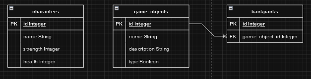

# LA NOCHE DE LOS ESPIRITUS

## COLABORADORES

- Juan Camilo García
- Susana Artime
- Roberto Lumbreras
- Rubén Blanco
- Abel Prieto
- Acacia Sánchez

## DESCRIPCION

Esta es una aplicación de Spring Boot que incluye una API REST con operaciones CRUD y un juego de consola que interactúa manualmente con la API.

## DIAGRAMAS UML

### DIAGRAMA DE CLASES

### DIAGRAMA ENTIDAD RELACION

## DIAGRAMA DE FLUJO

## INSTALACION
Descargar y ejecutar AidenGameApplication.exe

## GUIA DE USO

### API REST CRUD
Despues de lanzar la aplicacion, se puede consultar la documentacion interactiva de Swagger en este enlace http://localhost:8080/swagger-ui.html

Además se puede ver la informacion de la base de datos en memoria en la consola de H2 http://localhost:8080/h2-console/

### JUEGO DE CONSOLA
El jugador asumirá el papel de Aiden, quien se enfrentará a los tres tipos de villanos que Mortis ha liberado. A medida que avanza, recogerá objetos mágicos que le otorgarán poderes y habilidades especiales. El
objetivo final es derrotar a Mortis

Cuando el jugador se encuentre con un enemigo se desplegará un menu de combate en el que se podra elegir entre las siguientes acciones:

    - Atacar: inflije daño al enemigo utilizando el valor del poder de ataque de Aiden
    - Golpe Potente: inflije daño al enemigo igual a la suma del poder de ataque de Aiden +10 puntos de ataque (recarga de 3 turnos)
    - Escudo Protector: Reduce el daño recibido en 5 puntos (durante 2 turnos)
    - Acceder al menu de la mochila: el jugador podra elegir si quiere usar un objeto de la mochila, que otorgaran diferentes efectos al personaje. Tambien podra tirar un objeto o volver al menu de combate sin realizar ninguna accion. La mochila tiene un espacio maximo 3 de objetos.